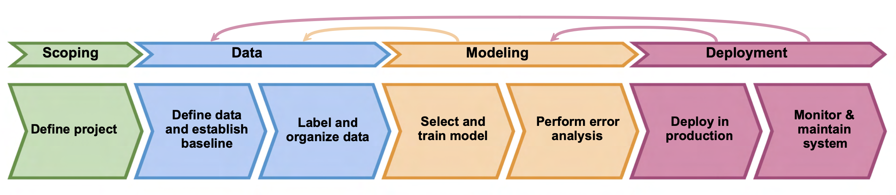

# CA4015-MLOPSPipelineImplementation
This Repo contains material for an MLOPS lecture for CA4015. The lecture covers most aspects of the MLOPS process at a high level and offers a practical example for students to work through to gain a deeper insight.

## Setup

This repo contains mainly Python code and some Jupyter Notebooks. I would recommend using [PyCharm](https://www.jetbrains.com/pycharm/)
as an IDE as you can quickly set up a Python virtual environment or [Conda](https://www.anaconda.com/download) if you'd prefer.
The [requirements file](requirements.txt) contains all the Python packages needed (It should!). You can either create a
virtual environment in PyCharm (it'll prompt at the top, or you can open the terminal along the bottom task bar and type
"pip install -r requirements.txt").

In order to use MLflow, you need to run mlflow server in the terminal. This will start MLflow as a service, the same way
Jupyter Notebook does. You can then log metrics to your MLflow and view it at https://localhost:5000/.

To run Jupyter Notebook type jupyter notebook in the terminal that you can open at the bottom task bar.

Only one of Jupyter or MLflow can run in the terminal as it is one instance. So ctrl + C first to stop one, then start the other.

If you have any questions about the content or run into any trouble with the setup pop me an email at **adam.tegart@dcu.ie**
___

## Content
The material is split into 4 sections, which each cover a piece in the pipeline that makes up MLOps.

### [1 - Scoping](Scoping)
Scoping is the first part of your ML Project and is the beginning of the process. 
Identifying a problem and planning the project. There are several considerations when starting a machine learning project that scoping aims to shed some light on. These include:

+ Identify the business problem you aim to solve, including the potential value of the solution.
+ Determine the feasibility of the project.
+ Decide on key metrics, striking a balance between machine learning metrics and business metrics (i.e. Precision vs Click through rate).
+ Outline the resources needed (Data, compute, manpower) and create a project timeline.
+ Consider any ethical or moral concerns with the project.

Scoping helps in planning an ML project, allowing for a more structured approach and (hopefully) reducing any unplanned setbacks.

### [2 - Data](DataPipeline)
Once the project is scoped it is time to consider the data that will be needed. Data is the backbone of any machine learning project, having the right, clean type of data with good predictive signal is key to creating a model that works well.
More often than not, a poor model with good data beats a good model with poor data. So what should we consider when it comes to data?

+ Translate the user needs into a data problem.
+ Consult with subject-matter experts (SMEs) to ensure data coverage and predictive signal.
+ Perform some data analysis to determine ranges of expected values and detect outliers.
+ Process the data, removing correlated features, performing feature engineering and selection if needed.
+ Consider security and user privacy.
+ Capture data provenance and lineage, versioning data if possible.

The aim of the data stage is to create a pipeline that allows you to pull data from your source and process it into a format that has rich predictive signal for your model. We will go into more detail in the Data section.

### [3 - ModelTraining](ModelTraining)
This is the section that we mostly associate with being a data scientist and carrying out a machine learning project.
The typical workflow may contain:

+ Model selection using neural architecture search (NAS)
+ Hyperparamter tuning to find optimal hyperparameters.
+ Transfer Learning
+ Model performance analysis
+ Explainability of your model
+ Bias mitigation through testing for fairness and bias within the model.
+ Risk mitigation by testing adversarial examples

By the end of this stage you should have a robust model that can (hopefully) be explained and is fair to all users.

### [4 - Deployment](Deployment)
This is the final part of the MLOps pipeline and from an ML perspective considers model size and monitoring.
For a look at deployment from a software side, check out Kieron's [CA4015-EmotionClassificationWebAPI](https://github.com/kdrumm-insight/CA4015-EmotionClassificationWebAPI).

From an ML perspective,deployment is:

+ Is the model a good fit in terms of compute, latency, throughput? This should have been addressed already during scoping!
+ Monitoring incoming data for anomalies in terms of data drift (The data looks different, different distribution)
+ Monitoring model performance to detect degradation, could be a sign of concept drift.

When the model start to degrade or the data changes, it's back to the data stage with your newly collected data.
If you have MLOps implemented well, the iterations become fast, you already have the training and testing code, automate it!

___
